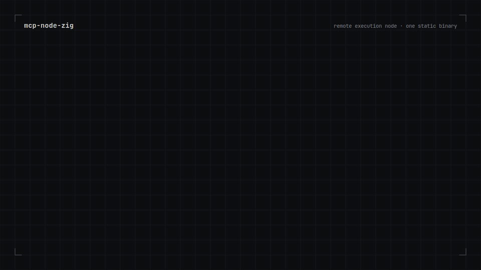

# mcp-node-zig

[](https://github.com/alexchen-sys/mcp-node-zig/actions/workflows/ci.yml)
[](https://github.com/alexchen-sys/mcp-node-zig/releases)
[](LICENSE)

[English](README.md) | Русский | [中文](README.zh.md)

Ваши серверы сами звонят домой. Агент получает структурный shell на любой машине, даже за NAT — ключи, периметр и kill switch остаются у вас.



mcp-node-zig — один статический бинарь, который говорит на MCP. Положите его на машину, и агент сможет запускать там команды, вести долгие сессии, читать и писать файлы. Нода сама звонит на ваш хаб (это тот же бинарь), поэтому машина не открывает входящих портов, SSH-ключ к агенту не попадает, а чужого облака на пути нет. Канал взаимно аутентифицирован HMAC-SHA256 и идёт через TLS, хаб ограничивает рукопожатия по источнику, а каждый вызов инструмента может лечь в аудит-лог с защитой от подделки.

Старт за 1.9 мс, 0.62 МиБ RSS в простое, 8.70 МиБ на диске, exec p50 0.7 мс / p99 1.5 мс, +288 КиБ на соединение. [Как мерили](BENCHMARKS.md).

## Установка

```sh
curl -fsSL https://raw.githubusercontent.com/alexchen-sys/mcp-node-zig/main/install.sh | sh
```

Скрипт сам определяет платформу, скачивает свежий релиз, сверяет его с `SHA256SUMS.txt` и ставит в `/usr/local/bin` (или `~/.local/bin`). Хаб со встроенным TLS-сервером: `MCP_NODE_FLAVOR=tls` (релизы Linux и macOS). Зафиксировать версию: `MCP_NODE_VERSION=0.3.0`, другой каталог: `PREFIX=/some/dir`.

Ручная установка, Linux x86_64:

```sh
curl -L https://github.com/alexchen-sys/mcp-node-zig/releases/download/v0.3.0/mcp-node-v0.3.0-x86_64-linux.tar.gz | tar xz
```

Для Linux ARM64, macOS (Apple Silicon) и Windows замените имя архива: `aarch64-linux.tar.gz`, `aarch64-macos.tar.gz`, `x86_64-windows.zip`. Все архивы и `SHA256SUMS.txt` лежат на [странице релиза](https://github.com/alexchen-sys/mcp-node-zig/releases); манифест подписан [cosign](https://github.com/sigstore/cosign) без ключей (Sigstore), и `install.sh` проверяет подпись, если cosign есть в PATH.

## Быстрый старт

```sh
openssl rand -hex 32 > token
./mcp-node-v0.3.0-x86_64-linux/mcp-node &

curl -sS http://127.0.0.1:8341/mcp \
  -H 'Content-Type: application/json' \
  -H "Authorization: Bearer $(cat token)" \
  --data '{"jsonrpc":"2.0","id":1,"method":"tools/call","params":{"name":"sys_info","arguments":{}}}'
```

В ответе придут имя хоста, ОС, load, память и uptime. Нода готова.

Подключение к Claude Code:

```sh
claude mcp add --transport http mcp-node http://127.0.0.1:8341/mcp \
  --header "Authorization: Bearer $(cat token)"
```

<details>
<summary>Windows (PowerShell)</summary>

```powershell
curl.exe -L -o mcp-node.zip https://github.com/alexchen-sys/mcp-node-zig/releases/download/v0.3.0/mcp-node-v0.3.0-x86_64-windows.zip
Expand-Archive mcp-node.zip
[guid]::NewGuid().ToString('N') + [guid]::NewGuid().ToString('N') | Set-Content -NoNewline -Encoding Ascii token
.\mcp-node-v0.3.0-x86_64-windows\mcp-node.exe
```

</details>

## Возможности

- Не нужно ничего ставить на целевую машину. Бинарь работает на Linux, macOS и Windows, включая хосты без OpenSSH.
- Долгие задачи не обрываются вместе с запросом. `exec_start` запускает процесс как сессию, агент читает вывод через `exec_poll` и `exec_wait`, пишет в stdin через `exec_write`. `exec_kill` убивает всё дерево процессов.
- Команды без сюрпризов от shell. `exec` передаёт argv напрямую, метасимволы остаются данными. Для пайпов и редиректов есть отдельный `exec_shell`.
- Файлы с проверкой. `read_file`, `list_dir`, а `write_file` возвращает SHA-256 записанного.
- Работает с любым MCP-клиентом по HTTP: Claude Code, Cursor, VS Code, Codex, Claude Desktop. stdio-клиенты запускают ноду напрямую через `--stdio`, см. ниже.

Всего 13 инструментов, схемы отдаёт `tools/list`.

## Режим stdio

Клиенты, которые сами запускают сервер подпроцессом, могут звать ноду напрямую с флагом `--stdio` (или `MCP_NODE_STDIO=1`). Сообщения идут построчно в формате JSON-RPC: один запрос на строку в stdin, один ответ на строку в stdout. Порт не слушается и токен не нужен: пайпы держит тот, кто запустил процесс. Логи пишутся только в stderr. Когда stdin закрывается, нода убивает оставшиеся сессии и выходит с кодом 0.

```json
{
  "mcpServers": {
    "mcp-node": {
      "command": "mcp-node",
      "args": ["--stdio"]
    }
  }
}
```

`--stdio` нельзя совмещать с `--connect` и `MCP_NODE_HUB_LISTEN`.

## Чем это отличается от SSH?

Это разные инструменты, и вместе они работают хорошо. SSH остаётся защищённым транспортом и терминалом для человека: шифрование, ключи, PTY, scp/sftp/rsync. mcp-node даёт агенту API исполнения: argv без повторного разбора удалённым шеллом, JSON-результат с `exit_code` и таймаутами, сессии, которые переживают обрыв соединения, запись файлов с SHA-256 и самоописание через `tools/list`.

Для удалённых машин [обратное подключение](#обратное-подключение-без-входящих-портов) заменяет туннель: на целевой машине не нужен sshd, а ключ не попадает к агенту. Где SSH уже стоит, они работают в паре: нода слушает `127.0.0.1`, а порт пробрасывается (`ssh -L 8341:127.0.0.1:8341 host`).

## Обратное подключение (без входящих портов)

Машину за NAT или без sshd запускают с `--connect hub:port`: нода сама звонит хабу (тот же бинарь с `MCP_NODE_HUB_LISTEN`), а клиенты ходят к ней через `/n/<name>/mcp` на хабе. По умолчанию канал идёт через TLS: порт хаба для нод слушает `127.0.0.1`, перед ним стоит TLS-терминатор (nginx `stream`, stunnel, HAProxy), а нода подключается с `MCP_NODE_CONNECT_TLS=1`:

```sh
# хаб; nginx/stunnel принимает TLS на :8400 и передаёт на 127.0.0.1:8401
MCP_NODE_HUB_LISTEN=127.0.0.1:8401 MCP_NODE_HUB_SECRET_FILE=nodes ./mcp-node
# нода; в `nodes` на хабе строка laptop:<secret>, в `secret` здесь только <secret>
MCP_NODE_NAME=laptop MCP_NODE_CONNECT_SECRET_FILE=secret MCP_NODE_CONNECT_TLS=1 \
  ./mcp-node --connect hub.example.com:8400
```

Для своего CA добавьте `MCP_NODE_CONNECT_CA_FILE`, для подключения по IP задайте `MCP_NODE_CONNECT_SERVER_NAME`. Конфиг терминатора и вариант без TLS для доверенной сети описаны в [docs/reverse-connect.md](docs/reverse-connect.md).

Релизная сборка `-tls` (или любой бинарь, собранный с `-Dtls-server`) умеет сам служить TLS на порту для нод (`MCP_NODE_HUB_TLS_CERT_FILE` / `MCP_NODE_HUB_TLS_KEY_FILE`), без терминатора спереди; тогда хаб видит настоящие адреса пиров и его лимиты рукопожатий по источнику работают в полную силу.

## Конфиг

Всё задаётся переменными окружения:

| Переменная | По умолчанию |
| --- | --- |
| `MCP_NODE_HOST` | `127.0.0.1` |
| `MCP_NODE_PORT` | `8341` |
| `MCP_NODE_TOKEN_FILE` | `./token` |
| `MCP_NODE_ALLOWED_HOSTS` | `127.0.0.1:*,localhost:*,[::1]:*` |
| `MCP_NODE_MAX_CONN` | `128` |
| `MCP_NODE_MAX_SESSIONS` | `64` |
| `MCP_NODE_SESSION_TTL_S` | `600` |
| `MCP_NODE_MAX_OUT` | `400000` байт на поток |
| `MCP_NODE_STDIO` | не задано; `1` — обслуживать одного клиента через stdin/stdout, без слушателя (то же, что `--stdio`) |
| `MCP_NODE_AUDIT_FILE` | не задано; включает [аудит-лог](docs/audit-log.md) по этому пути |
| `MCP_NODE_AUDIT_KEY_FILE` | не задано; HMAC-ключ цепочки аудита (0600), отдельный от токена и секрета связи |
| `MCP_NODE_AUDIT_ARGS` | `summary`; `full` пишет argv и пути целиком, содержимое — никогда |
| `MCP_NODE_AUDIT_ON_FULL` | `block`; `drop` сбрасывает записи при зависшем диске с цепочечным маркером `dropped` |
| `MCP_NODE_AUDIT_MAX_BYTES` | `67108864`; сверх этого файл уходит в `<file>.<first-seq>`, цепочка продолжается |

Остальные (`MCP_NODE_NAME`, `MCP_NODE_ALLOWED_ORIGINS`, `MCP_NODE_SOCKET_TIMEOUT_S`, `MCP_NODE_TEXT_MIRROR`) описаны в [README.md](README.md#configuration).

## Безопасность

- Без токена нода не стартует. Токен принимается в `Authorization: Bearer` или `X-Node-Token`, сравнение по SHA-256 за константное время.
- По умолчанию слушает только loopback. Чужой `Host` получает 421, чужой `Origin` получает 403.
- Канал ноды идёт через TLS: его обслуживает сам хаб в сборке с `-Dtls-server` или любой терминатор. Локальный HTTP API остаётся на loopback; для доступа снаружи поставьте спереди reverse proxy, например `caddy reverse-proxy --from node.example.com --to 127.0.0.1:8341`, или ходите через VPN.
- Агент получает права пользователя, от которого запущена нода. Запускайте её от того пользователя, чьи права готовы отдать.

### Модель угроз

- Кто держит клиентский токен, тот запускает команды. Токен хаба открывает все подключённые ноды.
- Хаб видит весь трафик открытым текстом, а хаб с секретом ноды может выполнить на ней что угодно.
- Секрет ноды равен шеллу на ней и закрепляет за ней имя. Строки `name:secret` дают каждому имени свой секрет; один общий секрет позволяет занять любое имя.
- Рукопожатие (HMAC-SHA256 по свежим nonce) только аутентифицирует стороны. Следующие кадры без TLS не шифруются и не защищены от подмены.
- Через чужие сети используйте `MCP_NODE_CONNECT_TLS=1`: нода всегда проверяет цепочку сертификатов и имя сервера, отключить проверку нельзя. Голый TCP оставьте для одного хоста или доверенной LAN.
- Лимиты рукопожатий считаются по адресу источника: хаб ведёт не больше 16 неаутентифицированных рукопожатий всего и 4 с одного IPv4-адреса или IPv6 /64, а 8 неудачных рукопожатий за минуту блокируют источник на минуту. Адреса 127.0.0.1 и ::1 из лимита исключены, поэтому за локальным TLS-терминатором все ноды выглядят одним адресом: задайте лимит на IP в самом терминаторе (nginx `limit_conn`) и, где можно, откройте публичный порт в файрволе только для известных адресов. Со встроенным TLS-сервером хаб видит настоящий адрес пира, и лимиты работают в полную силу.

## Аудит-лог

Задайте `MCP_NODE_AUDIT_FILE` — и каждый вызов инструмента оставляет одну
append-only JSONL-запись, сцепленную HMAC-SHA256: правки, удаления и
перестановки прошлых записей обнаруживаются офлайн:

```sh
openssl rand -hex 32 > audit-key && chmod 600 audit-key
MCP_NODE_AUDIT_FILE=/var/log/mcp-node.jsonl MCP_NODE_AUDIT_KEY_FILE=./audit-key ./mcp-node
mcp-node audit-verify --anchor /var/log/mcp-node.jsonl
```

Нода пишет каждый `tools/call` (инструмент, транспорт, пир, сводку аргументов,
результат), хаб пишет маршрутизацию `relay` и события линков; обе стороны
сходятся по `req_id`. Скрипты, содержимое файлов и stdout не пишутся никогда.
Подробности и модель угроз: [docs/audit-log.md](docs/audit-log.md).

## Дорожная карта

Уже в коде: обратное подключение со взаимным HMAC-рукопожатием, TLS на канале ноды (на всех платформах), лимиты рукопожатий по источнику, аудит-лог с защитой от подделки, подписанные cosign релизы с provenance-аттестацией.

Дальше: права по инструментам, сессии, которые переживают рестарт ноды, и PTY для интерактивных TUI. Версия `0.x`, контракт может меняться до 1.0.

## Ссылки

- [Бенчмарки](BENCHMARKS.md)
- [Полный README на английском](README.md): все клиенты, протокол, диагностика
- [Сборка из исходников](README.md#build-from-source): Zig 0.16.x, `zig build -Doptimize=ReleaseSafe`
- [Безопасность](SECURITY.md) · [Участие](CONTRIBUTING.md) · [MIT](LICENSE)
